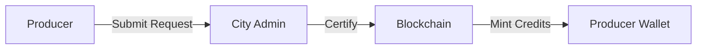
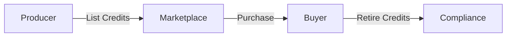

# HydroCred - Blockchain Green Hydrogen Credit System


## 🌿 Overview

HydroCred is a comprehensive blockchain-based platform for tracking, certifying, and trading green hydrogen credits (H2 tokens). Built with security, transparency, and scalability in mind, it provides a complete ecosystem for the green hydrogen economy.

### Key Features

- 🔐 **Blockchain Security**: Immutable records on Ethereum/Polygon
- ⚡ **Gasless Tokens**: ERC-20 compatible H2 credits representing 1 kg of certified green hydrogen
- 👥 **Role-Based Access**: Hierarchical system with Country/State/City Admins, Producers, Buyers, and Auditors
- 🏭 **Production Tracking**: Complete lifecycle from production request to credit minting
- 🛒 **Marketplace**: Decentralized trading platform for H2 credits
- 📊 **Analytics**: Comprehensive dashboards and reporting
- 🔍 **Audit Trail**: Complete transaction history and compliance monitoring

## 🏗️ Architecture

```
┌─────────────────┐    ┌─────────────────┐    ┌─────────────────┐
│   Frontend      │    │    Backend      │    │   Blockchain    │
│   React + TS    │◄──►│  Node.js + API  │◄──►│ Smart Contracts │
│   TailwindCSS   │    │   MongoDB       │    │   Hardhat       │
└─────────────────┘    └─────────────────┘    └─────────────────┘
```

### Tech Stack

**Frontend:**
- React 18 + TypeScript
- TailwindCSS + shadcn/UI
- Framer Motion (animations)
- ethers.js (blockchain interaction)
- React Query (state management)

**Backend:**
- Node.js + Express
- MongoDB + Mongoose
- JWT Authentication
- ethers.js + web3.js
- Comprehensive API with rate limiting

**Blockchain:**
- Solidity smart contracts
- Hardhat development environment
- OpenZeppelin libraries
- Support for local/testnet deployment

## 🚀 Quick Start

### Prerequisites

- Node.js 18+ and npm
- MongoDB (local or cloud)
- MetaMask browser extension
- Git

### Installation

1. **Clone the repository**
   ```bash
   git clone https://github.com/your-org/hydrocred.git
   cd hydrocred
   ```

2. **Install dependencies**
   ```bash
   npm run setup
   ```

3. **Set up environment variables**
   ```bash
   # Backend
   cp backend/.env.example backend/.env
   
   # Frontend
   cp frontend/.env.example frontend/.env
   
   # Contracts
   cp contracts/.env.example contracts/.env
   ```

4. **Start MongoDB**
   ```bash
   # Local MongoDB
   mongod
   
   # Or use MongoDB Atlas (update connection string in backend/.env)
   ```

5. **Deploy smart contracts**
   ```bash
   npm run contracts:compile
   npm run contracts:deploy
   ```

6. **Start the development servers**
   ```bash
   npm run dev
   ```

The application will be available at:
- Frontend: http://localhost:3000
- Backend API: http://localhost:5000
- Blockchain: http://localhost:8545

## 👥 User Roles & Hierarchy

### Role Structure

```
Country Admin
    └── State Admin
        └── City Admin (Certifier)
            ├── Producers
            └── Buyers
    └── Auditors (Independent)
```

### Role Permissions

| Role | Verify Users | Certify Production | Mint Credits | Trade Credits | View Audit |
|------|--------------|-------------------|--------------|---------------|------------|
| Country Admin | ✅ State Admins | ❌ | ❌ | ❌ | ✅ |
| State Admin | ✅ City Admins | ❌ | ❌ | ❌ | ✅ |
| City Admin | ✅ Producers/Buyers | ✅ Production | ❌ | ❌ | ✅ |
| Producer | ❌ | ❌ | ✅ Own Credits | ✅ Sell | ✅ Own |
| Buyer | ❌ | ❌ | ❌ | ✅ Buy/Retire | ✅ Own |
| Auditor | ❌ | ❌ | ❌ | ❌ | ✅ All |

## 🔄 Workflow

### 1. Production Request Flow



1. **Producer** submits production request with:
   - Production amount (kg)
   - Facility details
   - Production method & energy source
   - Proof documents
   
2. **City Admin** verifies and certifies the production
3. **Producer** mints H2 credits to their wallet
4. **Credits** are available for trading

### 2. Trading Flow



1. **Producer** lists credits on marketplace
2. **Buyer** purchases credits (payment in ETH/MATIC)
3. **Buyer** can retire credits for compliance
4. **All transactions** recorded on blockchain

## 🛡️ Security Features

### Fraud Prevention

- **Double Certification Prevention**: Database + blockchain hash verification
- **Role-Based Access Control**: Strict hierarchy enforcement
- **Signature Verification**: All sensitive operations require wallet signatures
- **Audit Logging**: Complete activity trail with risk assessment
- **Rate Limiting**: API protection against abuse

### Smart Contract Security

- **Role Verification**: On-chain role checks for all operations
- **Reentrancy Protection**: Safe external calls
- **Access Control**: OpenZeppelin's AccessControl implementation
- **Pausable**: Emergency stop functionality
- **Input Validation**: Comprehensive parameter checking

## 🧪 Demo Wallets

For hackathon testing, we provide 10 pre-configured demo wallets with different roles:

| Role | Name | Address | Use Case |
|------|------|---------|----------|
| Country Admin | Alice Johnson | `0x7099...79C8` | Full system oversight |
| State Admin | Bob Smith | `0x3C44...93BC` | Regional management |
| City Admin | Carol Davis | `0x90F7...b906` | Production certification |
| Producer | David Wilson | `0x15d3...6A65` | Small producer (1000 kg/day) |
| Producer | Eva Martinez | `0x9965...A4dc` | Large producer (2500 kg/day) |
| Producer | Frank Chen | `0x976E...0aa9` | Renewable producer (500 kg/day) |
| Buyer | Grace Thompson | `0x14dC...9955` | Steel manufacturing |
| Buyer | Henry Rodriguez | `0x2361...1E8f` | Transportation |
| Buyer | Isabel Garcia | `0xa0Ee...9720` | Chemical industry |
| Auditor | Jack Anderson | `0xBcd4...4096` | Independent auditor |

**⚠️ Security Warning**: These are demo wallets for testing only. Never use these private keys on mainnet!

See [demo-wallets.json](./demo-wallets.json) for complete details including private keys.

## 📊 API Documentation

### Authentication

All protected endpoints require a JWT token in the Authorization header:

```bash
Authorization: Bearer <your_jwt_token>
```

### Key Endpoints

#### Authentication
- `POST /api/auth/register` - Register new user
- `POST /api/auth/login` - Login with wallet signature
- `GET /api/auth/me` - Get current user info

#### Production
- `POST /api/production/request` - Submit production request
- `GET /api/production/requests` - Get production requests
- `POST /api/production/certify/:requestId` - Certify production
- `POST /api/production/mint/:requestId` - Mint credits

#### Marketplace
- `POST /api/marketplace/list` - Create marketplace listing
- `GET /api/marketplace/listings` - Get marketplace listings
- `POST /api/marketplace/purchase` - Purchase credits
- `POST /api/marketplace/retire` - Retire credits

#### Admin
- `GET /api/admin/dashboard` - Admin dashboard data
- `POST /api/admin/grant-role` - Grant role to user
- `GET /api/admin/fraud-alerts` - Get fraud alerts

#### Audit
- `GET /api/audit/logs` - Get audit logs
- `GET /api/audit/export` - Export audit data
- `GET /api/audit/compliance-report` - Compliance report

## 🔧 Configuration

### Environment Variables

#### Backend (.env)
```env
PORT=5000
NODE_ENV=development
MONGODB_URI=mongodb://localhost:27017/hydrocred
JWT_SECRET=your_super_secret_jwt_key
BLOCKCHAIN_RPC_URL=http://127.0.0.1:8545
H2_TOKEN_CONTRACT_ADDRESS=0x...
PRIVATE_KEY=0x...
```

#### Frontend (.env)
```env
VITE_API_URL=http://localhost:5000/api
VITE_CHAIN_ID=1337
VITE_RPC_URL=http://127.0.0.1:8545
VITE_CONTRACT_ADDRESS=0x...
```

#### Contracts (.env)
```env
PRIVATE_KEY=your_private_key_here
POLYGON_RPC_URL=https://rpc-mumbai.maticvigil.com
POLYGONSCAN_API_KEY=your_api_key_here
```

## 🚀 Deployment

### Local Development

```bash
# Start all services
npm run dev

# Or start individually
npm run backend:dev    # Backend on :5000
npm run frontend:dev   # Frontend on :3000
npx hardhat node       # Blockchain on :8545 (in contracts/)
```

### Production Deployment

1. **Smart Contracts**
   ```bash
   cd contracts
   npm run deploy:testnet  # Deploy to Polygon Mumbai
   ```

2. **Backend**
   ```bash
   cd backend
   npm run build
   npm start
   ```

3. **Frontend**
   ```bash
   cd frontend
   npm run build
   # Deploy dist/ folder to your hosting service
   ```

### Docker Deployment

```bash
# Build and run with Docker Compose
docker-compose up --build
```

## 🧪 Testing

### Smart Contract Tests

```bash
cd contracts
npx hardhat test
```

### API Tests

```bash
cd backend
npm test
```

### Frontend Tests

```bash
cd frontend
npm test
```

### Integration Testing

1. Start all services: `npm run dev`
2. Import demo wallets into MetaMask
3. Follow the testing workflow in demo-wallets.json

## 📈 Monitoring & Analytics

### Health Checks

- Backend: `GET /health`
- System Status: `GET /api/admin/system-health`

### Metrics

- User registration and verification rates
- Production request processing times
- Marketplace transaction volumes
- Credit retirement tracking
- Fraud detection alerts

## 🤝 Contributing

1. Fork the repository
2. Create a feature branch: `git checkout -b feature/amazing-feature`
3. Commit your changes: `git commit -m 'Add amazing feature'`
4. Push to the branch: `git push origin feature/amazing-feature`
5. Open a Pull Request

### Development Guidelines

- Follow TypeScript best practices
- Write comprehensive tests
- Update documentation
- Follow the existing code style
- Ensure security best practices

## 📄 License

This project is licensed under the MIT License - see the [LICENSE](LICENSE) file for details.

## 🆘 Support

- **Documentation**: [docs.hydrocred.com](https://docs.hydrocred.com)
- **API Reference**: [api.hydrocred.com](https://api.hydrocred.com)
- **Issues**: [GitHub Issues](https://github.com/your-org/hydrocred/issues)
- **Discord**: [HydroCred Community](https://discord.gg/hydrocred)
- **Email**: [support@hydrocred.com](mailto:support@hydrocred.com)

## 🙏 Acknowledgments

- OpenZeppelin for secure smart contract libraries
- Hardhat for development framework
- React and TypeScript communities
- MongoDB and Node.js ecosystems
- The green hydrogen industry pioneers

---

**Built with ❤️ for a sustainable future**

*HydroCred is committed to accelerating the adoption of green hydrogen through transparent, secure, and efficient credit trading.*