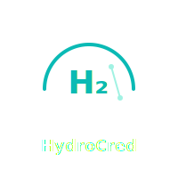

# HydroCred 🌊

**Blockchain-powered Green Hydrogen Credit System**

HydroCred is a decentralized application (DApp) for issuing, transferring, and retiring verified green hydrogen production credits on the blockchain. Built with immutable audit trails and role-based access control.



## 🚀 Quick Start

### Prerequisites

- **Node.js 18+** and **npm**
- **MetaMask** browser extension
- **Ethereum testnet** (Sepolia) or **Polygon Amoy** access

### Installation

1. **Clone and install dependencies:**
   ```bash
   git clone <repository-url>
   cd HydroCred
   npm install
   ```

2. **Configure environment:**
   ```bash
   cp env.example .env
   # Edit .env with your RPC URL and private key
   ```

3. **Compile and deploy contracts:**
   ```bash
   npm run chain:compile
   npm run chain:deploy
   ```

4. **Start the application:**
   ```bash
   npm run dev
   ```

5. **Access the app:**
   - **Frontend:** http://localhost:5173
   - **Backend API:** http://localhost:5055

## 🏗️ Architecture

```
HydroCred/
├── blockchain/          # Smart contracts (Hardhat)
├── backend/            # Express API server  
├── frontend/           # React + Vite app
├── logo/              # Brand assets
└── scripts/           # Automation scripts
```

## 🔐 Roles & Permissions

### 🛡️ Certifier
- **Issue verified credits** to hydrogen producers
- **Batch issuance** up to 1000 credits at once
- **View issuance history** with transaction links

### 🏭 Producer  
- **Manage owned credits** with real-time status
- **Transfer credits** to buyers or other parties
- **View credit portfolio** (active vs. retired)

### 👥 Buyer
- **Purchase credits** from producers
- **Retire credits** for carbon offset (permanent)
- **Download retirement proofs** (JSON certificates)

### 📊 Regulator
- **Monitor all transactions** with comprehensive audit trail
- **Filter and search** events by type and address
- **Export compliance reports** (blockchain explorer links)

## 🛠️ Technology Stack

- **Smart Contracts:** Solidity + Hardhat + OpenZeppelin
- **Backend:** Node.js + Express + TypeScript
- **Frontend:** React + Vite + Tailwind CSS + Framer Motion
- **Blockchain:** Ethereum (ERC-721) + Ethers.js
- **Styling:** Custom dark theme with teal accents

## 📋 Smart Contract Features

- **ERC-721 Standard:** Each credit is a unique NFT
- **Role-based Access:** Certifier and Admin roles
- **Batch Operations:** Efficient credit issuance
- **Retirement System:** Permanent credit retirement
- **Event Logging:** Complete audit trail
- **Pausable:** Emergency stop functionality

## 🔧 Development

### Available Scripts

```bash
# Root level
npm run dev              # Start frontend + backend
npm run chain:compile    # Compile smart contracts
npm run chain:deploy     # Deploy to testnet
npm run chain:test       # Run contract tests

# Individual workspaces
npm -w blockchain run test
npm -w backend run dev
npm -w frontend run dev
```

### Environment Variables

Create `.env` from `env.example`:

```bash
# Blockchain
RPC_URL=https://sepolia.infura.io/v3/YOUR_PROJECT_ID
PRIVATE_KEY=your_wallet_private_key
EXPLORER_API_KEY=your_etherscan_api_key

# Backend  
PORT=5055
AES_KEY=your_32_character_encryption_key

# Auto-populated after deployment
CONTRACT_ADDRESS=0x...
```

## 🌐 Demo Flow

1. **Deploy Contract** → Sets deployer as admin and certifier
2. **Connect MetaMask** → Switch to Sepolia testnet
3. **Certifier Issues Credits** → Batch issue to producer address
4. **Producer Transfers** → Send credits to buyer
5. **Buyer Retires** → Permanently retire for carbon offset
6. **Regulator Audits** → View complete transaction history

## 🔮 Future Enhancements

- **IPFS Integration** for document storage
- **Multi-sig Governance** for certifier management  
- **Carbon Credit Marketplace** with pricing
- **Mobile App** with QR code scanning
- **Oracle Integration** for real-world data feeds
- **Layer 2 Scaling** (Polygon, Arbitrum)

## 🐛 Troubleshooting

### Common Issues

**"Contract not deployed"**
- Run `npm run chain:deploy` first
- Check `.env` has correct `RPC_URL` and `PRIVATE_KEY`

**"MetaMask connection failed"**  
- Install MetaMask extension
- Switch to correct network (Sepolia)
- Ensure wallet has testnet ETH

**"Backend API errors"**
- Check backend is running on port 5055
- Verify `CONTRACT_ADDRESS` in environment

**"Transaction failed"**
- Ensure sufficient testnet ETH for gas
- Check wallet is connected to correct network
- Verify you have required role permissions

## 📄 License

MIT License - see LICENSE file for details.

---

**Built with ❤️ for a sustainable hydrogen future**